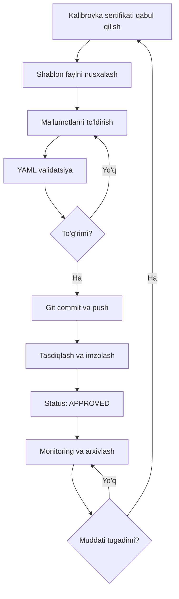

# 📋 ISO/IEC 17025:2019 Muvofiqlik Xulosalari Tizimi

> **EURO PROF TEST | Akkreditatsiyalangan Kalibrovka Laboratoriyasi**


---

## 🎯 LOYIHA HAQIDA

Ushbu repozitoriya **ISO/IEC 17025:2019** standartiga muvofiq kalibrovkalangan o'lchov asboblari uchun **muvofiqlik xulosalarini** (Statements of Conformity) yaratish va boshqarish tizimi.

### Asosiy xususiyatlari:

- ✅ **ISO/IEC 17025:2019 talablariga to'liq muvofiq**
- 🔧 **DevOps/Developer-friendly** format (YAML + Markdown)
- 📊 **Versiya nazorati** (Git) uchun optimallashtirilgan
- 🤖 **Avtomatik validatsiya** va monitoring
- 📝 **To'liq hujjatlashtirish** va shablon fayllari
- 🔍 **Traceability** (kuzatuvchanlik) zanjiri
- 📈 **Statistik tahlil** va hisobotlar

---

## 📂 PAPKA STRUKTURASI

```
metrologiya-/
│
├── 📄 README_ISO17025.md                    # Ushbu fayl
├── 📘 QOLLANMA_YANGI_USKUNA.md              # Qo'llanma (bosqichma-bosqich)
├── 📝 MUVOFIQLIK_XULOSASI_TEMPLATE.md       # Bo'sh shablon
│
├── 📋 XULOSALAR/                            # Muvofiqlik xulosalari katalogi
│   ├── README.md                            # Katalog haqida
│   ├── ISD3_2023387_MUVOFIQLIK_2026.md      # ✅ Brake Tester ISD-3
│   ├── MEGAOMMETR_93753_MUVOFIQLIK_2024.md  # ✅ Megaommetr
│   └── [YANGI_USKUNALAR]/                   # Kelajakdagi qo'shimchalar
│
├── 🛠️ scripts/                              # Yordamchi script'lar
│   ├── validate_yaml.py                     # YAML validatsiya
│   └── check_expiry.py                      # Muddatni tekshirish
│
├── 📁 certificates/                         # Kalibrovka sertifikatlari
│   └── 2026/
│       ├── ZD202601020251.pdf
│       └── UZ-07-206-2024.pdf
│
└── 📖 Qo'shimcha hujjatlar/
    ├── ИНСТРУКЦИЯ.md                        # Yandex Zen uchun (boshqa loyiha)
    ├── СТРУКТУРА.md
    ├── СТИЛЬ.md
    └── ИСТОЧНИКИ.md
```

---

## 🚀 TEZKOR BOSHLASH

### 1️⃣ Repozitoriyani klonlash

```bash
git clone https://github.com/muhriddinraupov62-coder/metrologiya-.git
cd metrologiya-
```

### 2️⃣ Mavjud xulosalarni ko'rish

```bash
# Barcha muvofiqlik xulosalari ro'yxati
ls -lh XULOSALAR/

# Biror xulosani o'qish
cat XULOSALAR/ISD3_2023387_MUVOFIQLIK_2026.md
```

### 3️⃣ Muddatlarni tekshirish

```bash
# 90 kun ichida muddati tugaydiganlar
python3 scripts/check_expiry.py --days 90

# 30 kun ichida muddati tugaydiganlar (URGENT)
python3 scripts/check_expiry.py --days 30
```

### 4️⃣ Yangi uskuna uchun xulosa yaratish

```bash
# Shablonni nusxalash
cp MUVOFIQLIK_XULOSASI_TEMPLATE.md XULOSALAR/YANGI_USKUNA_2026.md

# Tahrirlash (to'ldirish)
nano XULOSALAR/YANGI_USKUNA_2026.md

# Validatsiya qilish
python3 scripts/validate_yaml.py XULOSALAR/YANGI_USKUNA_2026.md

# Git'ga commit
git add XULOSALAR/YANGI_USKUNA_2026.md
git commit -m "feat: Add conformity assessment for [USKUNA NOMI]"
git push origin main
```

**To'liq qo'llanma**: [QOLLANMA_YANGI_USKUNA.md](./QOLLANMA_YANGI_USKUNA.md)

---

## 📊 MAVJUD USKUNALAR

### 1. Brake Tester ISD-3 (СЕНСОРИКА М, №2023.387)

```yaml
Document: XULOSALAR/ISD3_2023387_MUVOFIQLIK_2026.md
Status: ✅ MUVOFIQ
Valid until: 2027-01-02
Certificate: ZD202601020251
Laboratory: Shenzhen Zhongjidian (CNASL17800)
Standard: JJG 1160-2019 (China)

Parameters:
  - Speed: 0.72–180 km/h (±3.0 km/h)
  - Displacement: 1–200 m (±0.5%)

Results:
  - Speed: 6/6 PASS (100%)
  - Displacement: 5/5 PASS (100%)
```

---

### 2. Megaommetr ЦС0202-2 (зав. №93753)

```yaml
Document: XULOSALAR/MEGAOMMETR_93753_MUVOFIQLIK_2024.md
Status: ⚠️ MUDDATI O'TGAN (2026-05-13)
Valid until: 2026-05-13
Certificate: UZ-07/206-2024
Laboratory: O'zbekiston Milliy Metrologiya Instituti (UzNIM)
Standard: GOST 8.366-79 (Russia/Uzbekistan)

Parameters:
  - Resistance: 200 kΩ – 100 GΩ (±2.5%)
  - Test voltage: 100V – 2500V

Results:
  - Resistance: 5/5 PASS (100%)
  - Voltage: 5/5 PASS (100%)

⚠️ ACTION REQUIRED: Qayta kalibrovka talab qilinadi!
```

---

## 🛠️ SCRIPT'LAR

### validate_yaml.py - YAML Validatsiya

**Maqsad**: Muvofiqlik xulosasi faylida YAML sintaksisi va majburiy maydonlarni tekshirish

```bash
python3 scripts/validate_yaml.py XULOSALAR/ISD3_2023387_MUVOFIQLIK_2026.md
```

**Chiqish**:
```
✅ YAML blok #1: OK
✅ YAML blok #2: OK
...
✅ HAMMA TEKSHIRUVLAR O'TDI - Fayl to'g'ri!
```

---

### check_expiry.py - Muddatni Tekshirish

**Maqsad**: Kalibrovka muddati tugagan yoki tugayotgan uskunalarni topish

```bash
python3 scripts/check_expiry.py --days 90
```

**Chiqish**:
```
⚠️  MUDDATI TUGAYOTGAN USKUNALAR (90 kun ichida):
----------------------------------------------------------------------

🔴 Megaommetr ЦС0202-2 (№93753)
   📅 Muddati: 2026-05-13
   ⏰ Qolgan: -28 kun (MUDDATI O'TGAN!)
   🚦 Prioritet: JUDA TEZKOR
```

**Parametrlar**:
- `--days N`: N kun ichida muddati tugaydigan uskunalarni topish (default: 90)
- `--directory PATH`: Qaysi papkada qidirish (default: XULOSALAR)

---

## 📋 ISO/IEC 17025:2019 MUVOFIQLIK

Ushbu tizim quyidagi ISO 17025 bo'limlariga javob beradi:

### § 6.4 Jihozlar (Equipment)

- ✅ Har bir uskuna identifikatsiyalangan
- ✅ Kalibrovka holati aniq va qidiriladigan
- ✅ Kalibrovka sertifikatlari saqlanadi
- ✅ Kuzatuvchanlik (traceability) zanjiri hujjatlangan
- ✅ Kalibrovka intervallari belgilangan

### § 7.8.6 Muvofiqlik xulosasi (Statements of conformity)

- ✅ Spetsifikatsiya aniq ko'rsatilgan
- ✅ Qaror qabul qilish qoidasi (decision rule) hujjatlangan
- ✅ O'lchov noaniqliklarini hisobga olish
- ✅ Muvofiqlik bayonoti aniq va tushunarli
- ✅ Amal qilish muddati ko'rsatilgan

### § 7.8.7 Fikr va sharhlar (Opinions and interpretations)

- ✅ Tavsiyalar aniq asoslangan
- ✅ Cheklovlar (limitations) ko'rsatilgan
- ✅ Mas'uliyat belgisi qo'yilgan

### § 8.3 Hujjatlarni boshqarish (Control of records)

- ✅ Noyob hujjat identifikatori (Document ID)
- ✅ Versiya nazorati (Git)
- ✅ Tasdiq va imzolar hujjatlangan
- ✅ Arxivlash va saqlash tartibi

---

## 🔄 UMUMIY WORKFLOW



---

## 📚 HUJJATLAR

| Hujjat | Tavsif | Link |
|--------|--------|------|
| **README_ISO17025.md** | Asosiy README (ushbu fayl) | [Ko'rish](./README_ISO17025.md) |
| **QOLLANMA_YANGI_USKUNA.md** | Bosqichma-bosqich qo'llanma | [Ko'rish](./QOLLANMA_YANGI_USKUNA.md) |
| **MUVOFIQLIK_XULOSASI_TEMPLATE.md** | Bo'sh shablon | [Ko'rish](./MUVOFIQLIK_XULOSASI_TEMPLATE.md) |
| **XULOSALAR/README.md** | Katalog haqida | [Ko'rish](./XULOSALAR/README.md) |
| **ISD3_2023387_MUVOFIQLIK_2026.md** | Namuna (Brake Tester) | [Ko'rish](./XULOSALAR/ISD3_2023387_MUVOFIQLIK_2026.md) |
| **MEGAOMMETR_93753_MUVOFIQLIK_2024.md** | Namuna (Megaommetr) | [Ko'rish](./XULOSALAR/MEGAOMMETR_93753_MUVOFIQLIK_2024.md) |

---

## 🤝 CONTRIBUTING

### Yangi uskuna qo'shish

1. **Fork** qiling
2. **Branch** yarating: `git checkout -b feature/yangi-uskuna`
3. **Xulosa yarating**: `QOLLANMA_YANGI_USKUNA.md` ga qarang
4. **Validatsiya qiling**: `python3 scripts/validate_yaml.py ...`
5. **Commit qiling**: `git commit -m "feat: Add [USKUNA]"`
6. **Push qiling**: `git push origin feature/yangi-uskuna`
7. **Pull Request** oching

### Kod standartlari

- YAML syntax - to'g'ri chizilgan
- Markdown formatlash - GitHub flavored
- Commit messages - Conventional Commits formatida
- Branch naming - `feature/`, `fix/`, `docs/` prefikslari

---

## 📞 ALOQA

**EURO PROF TEST**
- 🏢 Address: House 37A, Olimlar Street, Mirzo Ulugbek, Tashkent, Uzbekistan
- 📧 Email: info@europroftest.uz
- 📱 Phone: +998 [TELEFON RAQAMI]
- 🌐 Website: [europroftest.uz](https://europroftest.uz)

**GitHub Issues**:
- 🐛 Bug report: [Create Issue](https://github.com/muhriddinraupov62-coder/metrologiya-/issues/new?template=bug_report.md)
- 💡 Feature request: [Create Issue](https://github.com/muhriddinraupov62-coder/metrologiya-/issues/new?template=feature_request.md)

---

## 📄 LITSENZIYA

© 2024-2026 EURO PROF TEST | Barcha huquqlar himoyalangan

Ushbu hujjatlar **maxfiy** hisoblanadi va faqat:
- EURO PROF TEST xodimlari
- Tasdiqlangan mijozlar
- Tegishli regulyativ organlar

uchun mo'ljallangan.

---

## 🔖 VERSIYA TARIXI

| Versiya | Sana       | O'zgarishlar                                    |
|---------|------------|-------------------------------------------------|
| 1.0.0   | 2026-06-09 | Dastlabki versiya - 2 ta uskuna bilan           |
| —       | —          | —                                               |

---

## 🎯 KELAJAK REJALARI

- [ ] Web interface (dashboard) yaratish
- [ ] PDF export funksiyasi
- [ ] Email bildirishnomalar (muddati tugashidan oldin)
- [ ] QR kod generator (uskuna label'lari uchun)
- [ ] Excel import/export
- [ ] API yaratish (boshqa tizimlarga integratsiya)
- [ ] Mobile app (uskuna holatini tekshirish)

---

## 💡 FAQ

### Q1: Yangi uskuna uchun qanday qilib xulosa yaratasam bo'ladi?

**A**: [QOLLANMA_YANGI_USKUNA.md](./QOLLANMA_YANGI_USKUNA.md) faylini o'qing - u yerda 12 bosqichli qo'llanma bor.

### Q2: YAML nima va nima uchun ishlatiladi?

**A**: YAML - bu insonlar uchun o'qish oson, dasturlar uchun parsing qilish oson format. Biz uni ishlatamiz chunki:
- Git'da diff ko'rish oson
- Avtomatik validatsiya mumkin
- Strukturaviy ma'lumotlar
- Kelajakda API/automation uchun qulay

### Q3: PyYAML o'rnatilmagan bo'lsa ishlaydi?

**A**: Ha, `validate_yaml.py` script PyYAML o'rnatilmagan bo'lsa ham "basic check" rejimida ishlaydi.

### Q4: Muddati o'tgan uskuna bilan nima qilish kerak?

**A**: 
1. Uskunani ishlatishdan **DARHOL** to'xtating
2. Kalibrovka laboratoriyasiga murojaat qiling
3. Qayta kalibrovka amalga oshiring
4. Yangi muvofiqlik xulosasi yarating

### Q5: Agar sertifikatda xato bo'lsa?

**A**: Darhol kalibrovka laboratoriyasiga qaytaring va to'g'ri sertifikat so'rang.

---

**🎉 Sizga muvaffaqiyatlar tilaymiz!**

**ISO/IEC 17025:2019** standartiga muvofiq kalibrovka va muvofiqlik xulosalari tizimingizni qurganingiz bilan tabriklaymiz!

---

**Oxirgi yangilanish**: 2026-06-09  
**Muallif**: Kiro AI + [SIZNING ISMINGIZ]  
**Versiya**: 1.0.0
